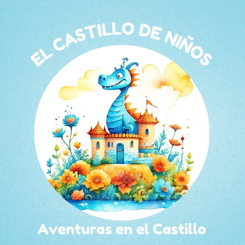

<!DOCTYPE html>
<html lang="es">
<head>
    <meta charset="UTF-8">
    <meta name="viewport" content="width=device-width, initial-scale=1.0">
    <title>El Castillo de Niños</title>
    
</head>
<body>
    <header>
        
        <h1>El Castillo de Niños</h1>
        
Apasionado por el mundo infantil

    </header>
    <section class="biography">
        <h2 class="section-title">Sobre Mí</h2>
        
Estoy apasionado por el mundo infantil. He publicado varios libros de colorear y solapas de letras en Amazon KDP, con el objetivo de educar y entretener a los niños.

    </section>
    <section class="projects">
        <h2 class="section-title">Proyectos</h2>
        
Aquí algunos de mis proyectos publicados en Amazon KDP:

        
        
        
        
    </section>
    <section class="skills">
        <h2 class="section-title">Habilidades</h2>
        <ul>
            <li>Creación de contenido educativo</li>
            <li>Diseño de libros de colorear</li>
            <li>Desarrollo de material didáctico</li>
        </ul>
    </section>
    <section class="contact">
        <h2 class="section-title">Contacto</h2>
        
Puedes seguirme en mis redes sociales:

        <ul>
            <li><a href="#">Facebook</a></li>
            <li><a href="#">Twitter</a></li>
            <li><a href="#">Instagram</a></li>
        </ul>
        
O enviarme un correo a: <a href="mailto:contacto@elcastillodeninos.com">contacto@elcastillodeninos.com</a>

    </section>
    <footer>
        
&copy; 2024 El Castillo de Niños. Todos los derechos reservados.

    </footer>
</body>
</html>
